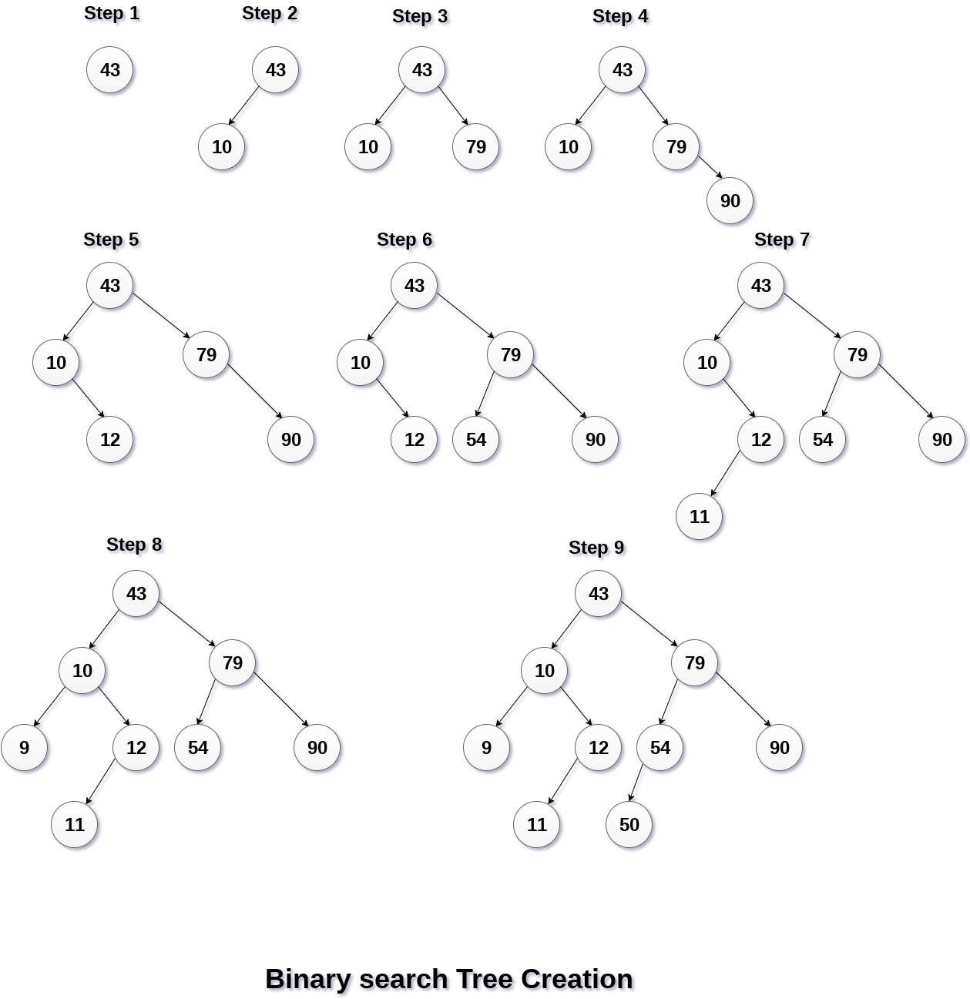
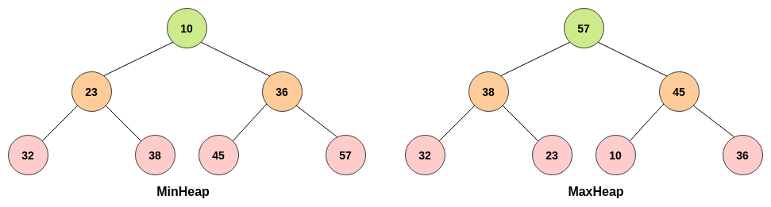
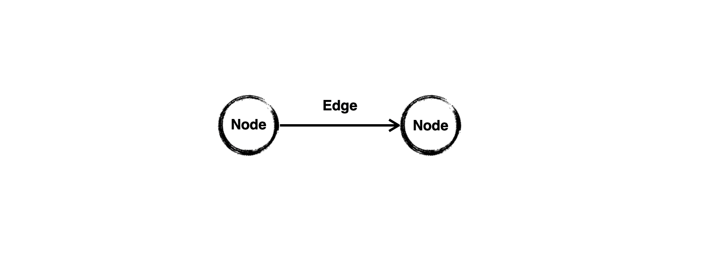
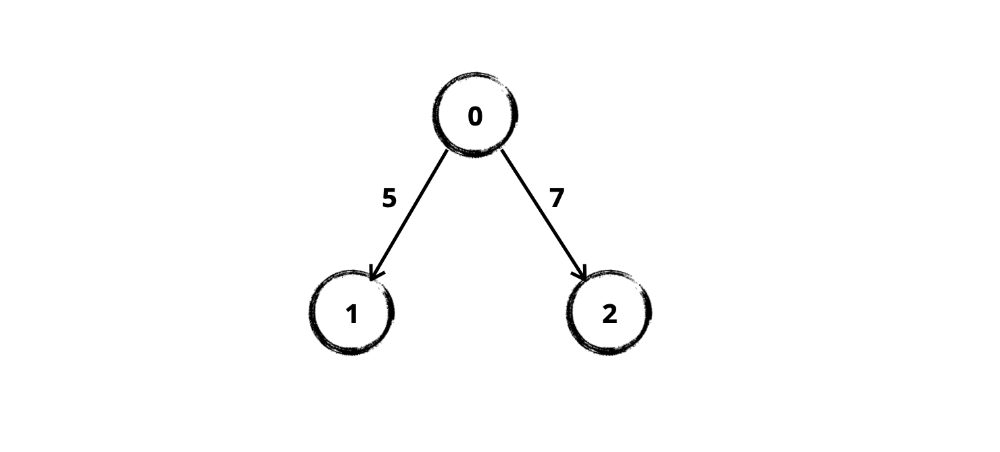
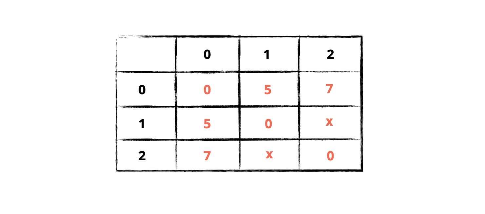
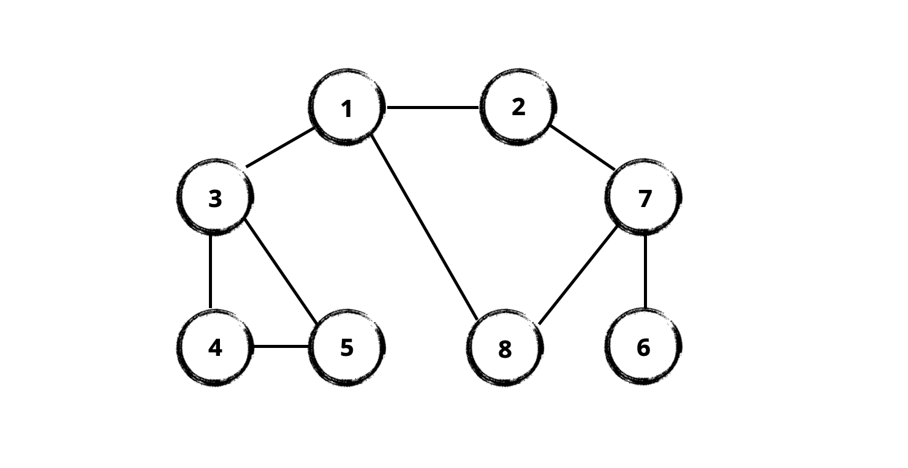

# Data Structures & Search

1. Stack & Queue
2. Recursion
3. Array & String
4. Linked List
5. Tree
6. Heap
7. Graph
8. DFS & BFS
9. Hash Table (Map)

<br />

## 1. Stack & Queue

Stack과 Queue는 Linear 자료구조로, 데이터를 넣고/빼는 방식을 제한함으로써 데이터를 관리합니다. 같은 Linear 자료구조인 [Array](https://leetcode.com/explore/learn/card/array-and-string/)가 Index를 사용해서 랜덤하게 데이터를 넣고 빼는 반면, 가장 마지막에 넣은 데이터부터 빼도록 제한된 것이 Stack, 가장 먼저 넣은 데이터부터 빼도록 제한된 것이 Queue 자료구조입니다. 이 두 자료구조를 사용할 때 체크할 점은 Overflow/Underflow 여부입니다. 할당된 크기가 다 찼는데 데이터를 넣으려고하면 Overflow, 아무것도 없는 빈 상태에서 빼내려고하면 Underflow입니다.

<br />

### 1-1. Stack

LiFo 자료구조입니다. Last in, 나중에 들어온게, First out, 먼저 나가는 방식으로 데이터를 다룹니다. JavaScript에서는 흔히 `Array` 객체의 `push()` & `pop()` 메소드를 사용해서 Stack 자료구조를 구현할 수 있습니다. JavaScript 런타임의 [호출 스택](https://developer.mozilla.org/en-US/docs/Glossary/Call_stack)이 대표적인 Stack 자료구조로, 런타임에서 가장 나중에 발견된(쌓인) 함수부터 차례로 실행되죠.

```typescript
const arr: string[] = []

arr.push('A') // ['A']
arr.push('B') // ['A', 'B']
arr.push('C') // ['A', 'B', 'C']

const popedItem = arr.pop() // ['A', 'B']
console.log(popedItem) // 'C'
```

만약 Size 제한이 있는 Stack을 구현한다면, `new Array(arrayLength)` 생성자를 사용해서 크기가 있는 배열을 사용할 수 있겠습니다.

```typescript
const stack: string[] = new Array(10)
```

<br />

### 1-2. Queue

FiFo 자료구조입니다. First in, 먼저 들어온게, First out, 먼저 나가는 방식으로 데이터를 다룹니다. JavaScript 런타임의 [메시지 큐](https://developer.mozilla.org/ko/docs/Web/JavaScript/EventLoop#%ED%81%90)가 대표적으로 Queue 자료구조를 사용합니다. JavaScript `Array` 객체의 `unshift()` & `pop()` 메소드를 사용해서 간단히 구현할 수 있고, 역방향 큐를 구현하려면 `push()` & `shift()` 조합을 사용하면 됩니다.

```typescript
const arr: string[] = []

arr.unshift('A') // ['A']
arr.unshift('B') // ['B', 'A']
arr.unshift('C') // ['C', 'B', 'A']

const popedItem = arr.pop() // ['C', 'B']
console.log(popedItem) // 'A'
```

<br />

### 1-🍎. What's next

- [Leetcode stack & queue overview](https://leetcode.com/explore/learn/card/queue-stack/)
- [Leetcode stack problems](https://leetcode.com/tag/stack/)
- [Leetcode queue problems](https://leetcode.com/tag/queue/)

<br />

## 2. Recursion

### 2-1. Recursion vs Loop

자기 자신을 호출하는 함수를 재귀함수(Reculsive Function), 이 기법을 재귀(Recursion)이라고 합니다. 반복해서 자기 자신을 호출하기 때문에 [`for`](https://developer.mozilla.org/en-US/docs/Web/JavaScript/Reference/Statements/for) Loop와 비슷하다고 생각하기 쉽지만, 이 둘은 작동 방식이 크게 다릅니다. Loop와 Recursion을 각각 사용하여 [Factorial(`n!`)](https://en.wikipedia.org/wiki/Factorial) 함수를 작성해보면 차이를 더 잘 볼 수 있습니다.

```typescript
// Loop
function factorial(num: number): number {
    let result = 1
    for (let i = 1; i <= num; i++) {
        result *= num
    }
    return result
}
```

```typescript
// Recursion
function factorial(num: number): number {
    if (num <= 1) return 1
    return num * factorial(num - 1)
}
```

다음과 같은 이유로 Recursion은 [FP](https://en.wikipedia.org/wiki/Functional_programming)에서도 유용합니다.

- Loop는 얼마나 반복할지를 정해야 하지만, Recursion은 반복 횟수에는 관심이 없고 Exit 조건이 중요합니다. 이 사실은 [깊이를 알기 어려운 Tree 자료구조를 탐색할 때도 유용](https://medium.com/weekly-webtips/simplifying-functional-programming-with-recursion-javascript-aa7007f4b159)한데, 길이나 깊이를 알 필요 없이 Exit 조건만 명확하면 되기 때문입니다.

- Recursion은 사람에게 친숙한 [점화식](https://ko.wikipedia.org/wiki/%EC%A0%90%ED%99%94%EC%8B%9D) 형태로 코드를 작성하게 해줍니다: _n! = n * (n-1)!_

<br />

### 2-2. Stack → Recursion

JavaScript에서 호출되는 모든 함수는 하나의 호출 스택에 쌓입니다. 자기 자신을 반복해서 호출하는 재귀함수 역시 반복해서 호출 스택에 쌓이므로, Recursion은 Stack 자료구조를 사용합니다. 역으로 생각하면, Stack 자료구조를 사용하는 알고리즘은 Recursion으로도 해결할 수 있습니다.

<br />

### 2-🍎. What's next

- [Leetcode recursion overview](https://leetcode.com/explore/learn/card/recursion-i/)
- [Leetcode recursion problems](https://leetcode.com/tag/recursion/)

<br />

## 3. Array & String

### 3-1. Dynamic Array

Array에 관해서라면, Fixed Array와 Dynamic Array를 구분할 수 있어야합니다. JavaScript에서 Array 객체로 구현된 Array는 기본적으로 Dynamic Array 입니다. Array를 초기화하는 방법에 따라 최초 길이가 다를 수는 있지만, 언제든 `push()`, `pop()`과 같은 Array 메소드들을 사용하여 길이를 변경할 수 있습니다. 참고로 `Array()` 생성자를 사용하면 지정된 길이를 가진 빈 Array가 할당되고, `[]`와 같이 리터럴 방식으로 초기화하면 실제 원소들로 채워진 만큼의 길이를 가진 Array가 할당됩니다.

```typescript
// array via constructor
const arr: string[] = new Array<string>(5) // array with 5 empty slots created

// array literal
const dynamicArr: string[] = []
```

<br />

실제로 위와 같이 선언한 것들을 콘솔에 찍어보면 다음과 같이 차이점을 확인할 수 있습니다.

```typescript
// array via constructor
console.log(arr.length) // 5
console.log(arr) // [empty × 5]

// array literal
console.log(dynamicArr.length) // 0
console.log(dynamicArr) // []
```

<br />

이번에는 각각 `push()` 메소드를 사용하여 원소를 추가해보겠습니다. 생성자를 사용해서 만든 `arr`의 경우, 이미 할당된 5 개의 빈 공간들을 침범하지 않고 추가 공간을 만들어 6 번째 원소로서 추가합니다.

```typescript
// array via constructor
arr.push('Yujin') // [empty × 5, 'Yujin']
console.log(arr.length) // 6

// array literal
dynamicArr.push('Yujin') // ['Yujin']
console.log(dynamicArr.length) // 1
```

<br />

### 3-2. Fixed Array

위에서 정리해본 것처럼 JavaScript에서 `Array` 객체만으로는 길이가 고정된 배열을 만들 수 없습니다. 원하는 길이의 빈 공간이 할당된 배열을 만들 수는 있지만 `push()` 메소드를 사용하여 언제든 길이를 늘릴 수 있기 때문입니다. JavaScript로 길이가 고정된 배열을 구현하려면 [`Object.seal()`](https://developer.mozilla.org/en-US/docs/Web/JavaScript/Reference/Global_Objects/Object/seal) 메소드를 사용하면 됩니다.

```typescript
Object.seal(arr)

arr.push('Bomin') // Uncaught TypeError: Cannot add property 6, object is not extensible
arr.pop() // Uncaught TypeError: Cannot delete property '5' of [object Array]
```

<br />

### 3-3. String

String(문자열)은 글자들로 이루어진 Array입니다. 그래서 거의 모든 언어에서 Array 객체에서 제공하는 메소드를 String 객체에서도 거의 동일하게 제공합니다. String에 대해 신경쓸 부분은, 사용하는 언어에서 String이 Mutable한지 Immutable한지를 구분해야 한다는 것입니다. 예를 들어 JavaScript에서 String은 Immutable 한데, 이게 무슨 말이나면요. 다음과 같이 Index를 사용해서 String의 한 글자를 Read 할 수는 있지만, Write 할 수 없다는 뜻입니다. TypeScript를 사용하신다면 진작에 `Index signature in type 'String' only permits reading.ts(2542)`라는 에러 메시지를 보실 수 있습니다!

```typescript
let str = 'hello world'
str[5] = ','
console.log(str[5]) // ' '

str = 'hello,world'
console.log(str) // 'hello,world'
```

<br />

### 3-🍎. What's next

- [Leetcode array overview](https://leetcode.com/explore/featured/card/fun-with-arrays/)
- [Leetcode array & string overview](https://leetcode.com/explore/learn/card/array-and-string/)
- [Leetcode array problems](https://leetcode.com/tag/array/)
- [Leetcode string problems](https://leetcode.com/tag/string/)

<br />

## 4. Linked List

### 4-1. Linked List vs Array

Linked List는 마치 Array처럼 동작하지만, 매우 다릅니다. Array는 Index로 구분할 수 있는 원소들의 논리적 순서와 각 원소가 메모리 상에서 갖게되는 주소의 순서가 일치합니다. 반면 Linked List의 노드들은 논리적 순서와 물리적 순서가 다른데, 메모리 상에서는 연속된 주소가 할당되지 않고 제각각 존재하지만 서로에 대한 연결정보를 통해 논리적인 순서를 갖습니다. 이렇듯 서로 다른 메커니즘때문에 다음과 같은 차이점들이 있습니다.

<br />

#### 탐색

- Array는 Index를 통해 특정 원소에 Random Access가 가능하다. 원소들이 연속된 메모리 주소를 갖기 때문. 시간복잡도는 `O(1)`.
- Linked List에서 특정 노드에 접근하려면 첫 번째 원소부터 순차적으로 검사해야만 가능하다. 최악의 경우 시간복잡도는 `O(N)`.

<br />

#### 삽입/삭제

- Array에 삽입/삭제가 발생하면 시간복잡도는 `O(N)`이다. 각 원소를이 차례로 밀리며 메모리의 연속된 주소상에 있도록 조정되기 때문.
- Linked List에 삽입/삭제가 발생해도, 최악의 경우 시간복잡도는 `O(N)`이 되는데 이는 삽입/삭제하려는 노드를 탐색하는 과정이 수반되기 때문.

<br />

### 4-2. Linked List in TypeScript

JavaScript는 Linked List를 네이티브 객체로 제공하지 않기 때문에 [다음과 같이](./linkedList.ts) 직접 구현해서 사용할 수 있겠습니다. `LNode` 클래스는 자기 자신과 다음 노드에 대한 정보를 갖고, `LinkedList` 클래스는 가장 첫 번째 노드에 대한 정보와 List의 길이 정보를 갖도록하는 식으로 구현해볼 수 있습니다. [Implementation of LinkedList in Javascript | GeeksForGeeks](https://www.geeksforgeeks.org/implementation-linkedlist-javascript/) 문서를 참고했습니다.

```typescript
class LNode<T> {
    node: LNode<T>
    next: LNode<T> | null

    constructor(node: LNode<T>) {
        this.node = node
        this.next = null
    }
}

```

<br />

```typescript
interface ILinkedList<T> {
    addNew(node: LNode<T>): void
    insertAt(node: LNode<T>, index: number): boolean
    removeFrom(index: number): LNode<T> | null
    removeElement(node: LNode<T>): LNode<T> | null
    indexOf(node: LNode<T>): number
    getHeadNode(): LNode<T> | null
    getSize(): number
    isEmpty(): boolean
}

class LinkedList<T> implements ILinkedList<T> {
    private head: LNode<T> | null
    private size: number

    constructor() {
        this.head = null
        this.size = 0
    }

    // methods...
}
```

<br />

### 4-🍎. What's next

- [Leetcode linked list overview](https://leetcode.com/explore/learn/card/linked-list/)
- [Leetcode linked list problems](https://leetcode.com/tag/linked-list/)

<br />

## 5. Tree

Tree 자료구는 [DOM](https://developer.mozilla.org/en-US/docs/Web/API/Document_Object_Model)을 생각하면 됩니다. 루트 노드인 `html`을 시작으로 자식 노드들이 계층 형태로 파생되는 것이 DOM의 형태이죠. DOM은 Tree 자료구조를 사용합니다.

<br />

### 5-1. BST(Binary Search Tree)

[BST, 이진탐색트리](https://leetcode.com/explore/learn/card/introduction-to-data-structure-binary-search-tree/)는 최대 2개의 자식 노드만 허용하는 Tree로, Tree에 데이터를 넣을 때 다음 규칙을 따르는 것이 특징입니다. 나름의 정렬 방식인건데, 이 방식 덕분에 BST의 가장 작은 값은 가장 왼쪽 끝 노드에, 가장 큰 값은 가장 오른쪽 끝 노드에서 바로 찾을 수 있습니다.

- 왼쪽 자식 트리는 부모 노드보다 작은 값만 포함합니다.
- 오른쪽 자식 트리는 부모 노드보다 큰 값만 포함합니다.
- 중복된 값을 허용하지 않습니다.

<br />



<br />

사진출처: [Data Structure(2)(Tree, Hash table, Graph, Binary Search Tree) - Hwanseog Choi](https://medium.com/@hwanseogchoi/data-structure-2-tree-hash-table-graph-binary-search-tree-d5fdfa6afc5e)

<br />

### 5-2. BST in TypeScript

JavaScript에서 BST는 [이렇게](./bst.ts) 구현해볼 수 있습니다. 각 노드의 데이터로 사용될 값은 서로 대소 비교가 가능해야하므로, `BSTData`와 같이 Type Alias를 사용해서 제한할 수 있습니다.

```typescript
export type BSTData = number | string // type alias

class TNode<T> {
    data: T
    left: TNode<T> | null
    right: TNode<T> | null

    constructor(data: T) {
        this.data = data
        this.left = null
        this.right = null
    }
}
```

<br />

```typescript
interface IBinarySearchTree<T> {
    insert(data: T): TNode<T>
    remove(data: T): TNode<T> | null
    traverseInorder(node: TNode<T> | null, result: T[]): T[]
    traversePreorder(node: TNode<T> | null, result: T[]): T[]
    traversePostorder(node: TNode<T> | null, result: T[]): T[]
    searchNode(node: TNode<T> | null, data: T): TNode<T> | null
    getRootNode(): TNode<T> | null
}

class BinarySearchTree<T> implements IBinarySearchTree<T> {
    private root: TNode<T> | null

    constructor() {
        this.root = null
    }

    // methods ...
}
```

<br />

### 5-3. DFT(Depth First Traversal)

DFT는 Tree를 Depth First, 깊이 우선 순회하는 방법으로 보통 다음의 3가지로 나누어 이야기합니다. DFT는 DFS와 비슷하게 형제 노드보다 자식 노드를 우선으로 순회하기 때문에 코드로 DFT를 구현할 때는 Stack 자료구조가 사용되고, Stack은 Recursion으로 대체할 수 있으니 Recursion을 사용해서 구현하기도 합니다.

#### Pre-order

위에서 생성한 Tree를 Pre-order 방법으로 순회하면 다음과 같이 데이터를 추출할 수 있습니다. 부모 → 왼쪽 → 오른쪽 자식 순으로 데이터를 추출하는데, Tree를 순회하면서 부모 노드를 만나면 즉시 추출하는 방식입니다.

```
43 → 10 → 9 → 12 → 11 → 79 → 54 → 50 → 90
```

#### In-order

In-order 방법은 왼쪽 → 부모 → 오른쪽 자식 순으로 데이터를 추출합니다. 왼쪽 Tree를 먼저 추출한 후 오른쪽 Tree로 넘어가기 전에 부모 노드를 추출합니다. In-order 순회 방법은 BST에서 찰떡인데, 아래와 같이 추출 과정에서 데이터가 자동으로 정렬되기 때문입니다.

```
9 → 10 → 11 → 12 → 43 → 50 → 54 → 79 → 90
```

#### Post-order

왼쪽 → 오른쪽 → 부모 순으로 데이터를 추출합니다.

```
9 → 11 → 12 → 10 → 50 → 54 → 90 → 79 → 43
```

<br />

### 5-4. BFT(Breadth First Traversal)

Tree의 깊이보다 너비가 클 때는 BFT가 더 나은 선택일 수 있습니다. DFT와 달리, 자식 노드보다는 형제 노드를 우선적으로 순회합니다. DFT가 Stack을 사용한다면, BFT는 Queue를 사용합니다.

<br />

### 5-🍎. What's next

- [Leetcode binary tree overview](https://leetcode.com/explore/learn/card/data-structure-tree/)
- [Leetcode binary tree problems](https://leetcode.com/tag/binary-tree/)

<br />

## 6. Heap

### 6-1. Heap as a Complete Binary Tree

Binary Heap은 일종의 Tree 자료구조 중 하나인데, Tree 중에서도 Complete Binary Tree와 거의 유사합니다. Complete Tree는 마지막 Depth를 제외한 나머지 Depth에 노드들이 모두 차있고, 노드를 추가할 때 마지막 Depth의 가장 왼쪽부터 노드가 채워집니다. Heap은 기본적으로 Max Heap, Min Heap 두 가지로 나뉘는데, `O(1)`의 시간복잡도로 최댓값이나 최솟값에 바로 접근하도록 고안된 자료구조이기 때문입니다.

- Max Heap: 부모 노드의 값이 자식 노드들의 값보다 항상 큼
- Min Heap: 부모 노드의 값이 자식 노드들의 값보다 항상 작음

<br />



사진출처: [Implementing Heaps in JavaScript - Ankita Masand](https://blog.bitsrc.io/implementing-heaps-in-javascript-c3fbf1cb2e65)

<br />

위에서 언급했듯이 Heap은 최댓값, 최솟값을 효율적으로 찾는데 최적화된 자료구조입니다. 즉, 여러 일들을 Priority에 따라 정리하고 우선순위별로 탐색할 때도 매우 유용합니다. 이러한 Heap의 특성을 사용하여 Heap 기반으로 만들어진 자료구조가 [Priority Queue](https://en.wikipedia.org/wiki/Priority_queue)입니다. Heap은 실제로 OS가 우선순위에따라 Job들을 스케쥴링할 때도 사용합니다.

<br />

#### 시간복잡도

Binary Heap을 사용할 때 시간복잡도는 각각 다음과 같은데요, Binary Tree 형태를 갖기 때문에 특정 노드를 추가하거나 제거할 때의 시간복잡도는 `O(logN)`이 됩니다. Binary 형태의 자료구조는 늘 절반씩 나누어 탐색할 수 있기 때문입니다!

- 최댓값/최솟값 접근: `O(1)`
- 노드 추가/제거: `O(logN)`

<br />

### 6-2. Array를 사용한 Heap 구현

Heap은 보통 Array를 사용해서 구현하는데, 부모 노드와 자식 노드의 관계를 연역해보면 다음 패턴을 발견할 수 있습니다. [Array Representation Of Binary Heap | GeeksForGeeks](https://www.geeksforgeeks.org/array-representation-of-binary-heap/) 글을 참고했습니다.

- `arr[i]`의 부모 노드는 `arr[Math.floor((i - 1)/ 2)]`
- `arr[i]`의 왼쪽 자식 노드는 `arr[(2 * i) + 1]`
- `arr[i]`의 오른쪽 자식 노드는 `arr[(2 * i) + 2]`

<br />

### 6-3. Min Heap in TypeScript

Min Heap은 [이렇게](./minheap.ts) 구현해보았고, [Binary Heap | GeeksForGeeks](https://www.geeksforgeeks.org/binary-heap/) 글을 참고했습니다.

```typescript
export type BinaryHeapData = number | string // type alias

interface IMinHeap<T> {
    insert(node: T): void
    getParent(index: number): T | null
    getLeftChild(index: number): T | null
    getRightChild(index: number): T | null
    getMin(): T | null
    getSize(): number
}

class MinHeap<T> implements IMinHeap<T> {
    private heap: T[]

    constructor() {
        this.heap = []
    }

    // methods ...
}
```

<br />

Min Heap에 노드를 추가하는 일은 Recursion을 사용했는데, 일단 노드를 Array의 가장 끝에 Push한 후 부모 노드와 비교하여 부모 노드보다 값이 작다면 서로 Swap하는 일을 Tree Depth를 거스르며 반복하도록 했습니다.

```typescript
class MinHeap<T> implements IMinHeap<T> {
    // ..

    insert(node: T) {
        this.heap.push(node) // 일단 push
        this.heapifyUp(this.heap.length - 1) // 부모 노드와 비교하고 swap
    }

    private heapifyUp(index: number) {
        const parentIndex = this.getParentIndex(index)

        if (parentIndex < 0) return

        if (this.heap[parentIndex] > this.heap[index]) {
            // swap
            const parent = this.heap[parentIndex]
            this.heap[parentIndex] = this.heap[index]
            this.heap[index] = parent
            // recursion
            this.heapifyUp(parentIndex)
        }
    }   
    
    // ..
}
```

<br />

### 6-4. Max Heap in TypeScript

Max Heap은 구현에 있어서 Min Heap과 다를 것이 거의 없습니다. 노드를 추가할 때 부모 노드와의 값 비교시 부등호의 방향만 반대입니다.

```typescript
class MaxHeap<T> implements IMaxHeap<T> {
    // ..

    insert(node: T) {
        this.heap.push(node) // 일단 push
        this.heapifyUp(this.heap.length - 1) // 부모 노드와 비교하고 swap
    }

    private heapifyUp(index: number) {
        const parentIndex = this.getParentIndex(index)

        if (parentIndex < 0) return

        if (this.heap[parentIndex] < this.heap[index]) {
            // swap
            const parent = this.heap[parentIndex]
            this.heap[parentIndex] = this.heap[index]
            this.heap[index] = parent
            // recursion
            this.heapifyUp(parentIndex)
        }
    }   
    
    // ..
}
```

<br />

## 7. Graph

Graph 자료구조는 여러 관점에서 설명할 수 있는데, 가장 간단하게 Tree 자료구조에서 "부모 노드는 하나만 가질 수 있다"는 규칙을 제외하면 Graph 자료구조가 됩니다. _many-to-many_ 관계인 데이터들을 담아야할 때 Graph 자료구조가 사용됩니다.



Graph에서 다음 개념들을 알아둬야 합니다. 위의 Tree 섹션에서 언급했던 용어들이고, 동일한 개념입니다.

- 노드 : Graph의 각 지점
- 엣지 : 노드와 노드를 연결하는 선으로, 노드간 관계를 나타냄
- 인접 : 두 노드가 엣지를 통해 직접 연결되어 있으면, 두 노드는 인접(Adjacent)하다고 함

<br />

### 7-1. Adjacency Matrix

Graph 자료구조를 코드에서 다루기 위해서는 명확한 표현 방법이 필요한데, 그 중 하나가 [Adjacency Matrix](https://en.wikipedia.org/wiki/Adjacency_matrix) 입니다. 노드와 노드의 관계를 각각 `(x, y)` 형태의 Matrix(행렬)로 나타낼 수 있다는 아이디어로, 아래와 같이 `0` 노드와 `1` 노드를 잇는 엣지에 `5`라고 번호를 매기면 `(0, 1) = 5`로 노드의 연결 관계를 표현합니다. 같은 방식으로 `1` 노드와 `2` 노드는 연결되어있지 않으므로 `(1, 2) = null`로 표현할 수 있겠죠.



<br />

위 Graph의 모든 노드와 노드의 연결 관계를 Matrix로 나타내면 다음과 같습니다.



<br />

코드에서 Matrix는 흔히 이차원배열을 사용해서 표현합니다. 만약 노드 `0`과 노드 `2`의 연결 관계를 알고싶다면, `graph[0][2]`로 접근하면 되기 때문에, 두 노드의 관계를 간편하게 확인하고 싶을 때는 Matrix를 사용하는 것이 최고의 방법입니다.

```typescript
type Nullable<T> = T | null;

const graph: Nullable<number>[][] = [
    [0, 5, 7],
    [5, 0, null],
    [7, null, 0],
]
```

```typescript
console.log(graph[0][2]) // 7
```

<br />

### 7-2. Adjacency List

[Adjacency List](https://en.wikipedia.org/wiki/Adjacency_list)는 Matrix와 달리 List 관점에서 Graph 자료구조를 바라보는 방법으로, 두 노드간에 아무런 관계가 없다면 데이터를 저장하지 않습니다.


<br />

코드에서 Adjacency List는 [`Array`](https://developer.mozilla.org/ko/docs/Web/JavaScript/Reference/Global_Objects/Array)나 [`Map`](https://developer.mozilla.org/en-US/docs/Web/JavaScript/Reference/Global_Objects/Map) 을 사용해서 구현할 수 있는데, 배열을 사용한다면 각 Index가 Graph의 각 노드를 나타내도록 합니다. 예를 들어 위의 Graph를 구현할 때, `graph`라는 이름의 배열을 만들었다면, `graph[0]`은 노드 `0`의 인접 정보를 담습니다: `graph[0] = [[1, 5], [2, 7]]`

> An entry array[i] represents the list of vertices adjacent to the ith vertex. - [Graph and its representations | GeeksForGeeks](https://www.geeksforgeeks.org/graph-and-its-representations/)

```typescript
type AdjNode = number[]

const graph: AdjNode[][] = [
    [[1, 5], [2, 7]],
    [[0, 5]],
    [[0, 7]],
]
```

만약 노드 `0`과 노드 `2`의 연결 관계를 알고싶다면, 다음과 같이 인접하는 노드 정보를 순회하면서 확인해야 합니다. 직관적인 확인은 어렵지만, 실제로 연결된 정보만 저장하기 때문에 Matrix에 비해 메모리 사용에 이점이 있습니다. 따라서 특정 노드와 연결된 모든 노드들을 순회하면서 검사해야하는 경우라면, Matrix보다 메모리와 순회를 절약할 수 있는 List가 더 적합합니다.

```typescript
const node1: number[][] = graph[0] // [[1, 5], [2, 7]]
const filtered = node1.filter(item => item[0] === 2) // [[2, 7]] → 7
```

다음과 같이 노드들의 인접 여부만 나타낼 수도 있고요.

```typescript
const graph: number[][] = [
    [1, 2],
    [0],
    [0],
]
```

<br />

`Map`을 사용하면 조금 더 명확하게 표현할 수 있다고 보는데요, 배열을 사용하면 각 노드에 담는 데이터가 `number` 타입이 아닐 경우 배열의 Index와 별도로 매핑해줘야하기 때문입니다.

```typescript
const graph: Map<number, number[]> = new Map()
graph.set(0, [1, 2])
graph.set(1, [0])
graph.set(2, [0])
```

<br />

### 7-3. Adjacency Matrix vs Adjacency List

상황에 따라 Matrix와 List 형태 중 더 나은 것을 선택해서 사용하면 됩니다. 각각의 장단점을 정리해보면,

- Matrix: 모든 노드와 노드의 관계를 나타내기 때문에 메모리를 절약할 수 없지만 (공간복잡도 `O(N²)`), 특정한 두 노드의 관계를 알고싶다면 한 번에 접근할 수 있음. 이때 시간복잡도는 `O(1)`.

- List: 실제 연결이 있는 경우에만 연결 정보를 담으면 되므로 메모리 절약, 특정한 두 노드의 관계를 알기 위해서는 인접 노드들을 순회하면서 찾아야하므로 느릴 수 있음

<br />

### 7-4. Directed vs Undirected

Graph는 노드를 연결하는 엣지들이 방향성을 가지는지 여부에 따라 Directed / Undirected Graph로 나뉩니다. 바로 위에서 그림으로 살펴본 Graph는 엣지들이 화살표를 통해 노드 A가 노드 B를 가리키는 모양이므로 Directed Graph 입니다. `Map`을 사용해서 Adjacency List 형태의 Directed Graph를 코딩한다면, 다음과 같이 방향 정보를 포함해볼 수 있겠습니다.

```typescript
interface AdjNode<T> {
    node: T
    isForward: boolean
}

const graph: Map<number, AdjNode<number>[]> = new Map()
graph.set(0, [{ node: 1, isForward: true }, { node: 2, isForward: true }])
graph.set(1, [{ node: 0, isForward: false }])
graph.set(2, [{ node: 0, isForward: false }])
```

<br />

### 7-5. Graph in TypeScript

저는 `Map`을 사용해서 Adjacency List 형태의 Undirected Graph를 구현해보았고, [Implementation of Graph in JavaScript | GeeksForGeeks](https://www.geeksforgeeks.org/implementation-graph-javascript/)를 참고했습니다. 전체 코드는 [여기에](./graph.ts) 있어요.

```typescript
interface IGraph<T> {
    addVertex(v: T): T | null
    addEdge(v: T, w: T): void
    dfs(startV: T): T[]
    dfsRecur(v: T, visited: Set<T>, result: T[]): T[]
    bfs(startV: T): T[]
    getSize(): number
    getAdjList(): Map<T, T[]>
}

class Graph<T> implements IGraph<T> {
    private size: number
    private adjList: Map<T, T[]>

    constructor(size: number) {
        this.size = size
        this.adjList = new Map()
    }

    // methods ...
}
```

### 7-🍎. What's next

- [Leetcode graph problems](https://leetcode.com/tag/graph/)

<br />

## 8. DFS & BFS

DFS/BFS는 탐색 알고리즘 중에서도 자주 언급되는 것들인데, 탐색 방향에 있어 각각 Depth/Breadth(깊이/너비) 기준으로 First Search(우선 탐색)하는 알고리즘입니다. 다음 그래프를 `1` 노드부터 DFS, BFS 해보면서 정리해보려고 합니다. Pre-order 이고, 같은 레벨의 노드 중에서는 숫자가 작은 노드부터 순회합니다.



<br />

### 8-1. DFS

DFS, 깊이우선탐색. 위의 그래프를 DFS하면 데이터를 이렇게 추출할 수 있습니다. 일단 하나의 자식 노드를 탐색하기 시작하면, 해당 자식이 갖고있는 하위 Tree를 모두 탐색한 후에 그 자식의 형제 노드를 탐색하기 시작합니다.

```
1 → 2 → 7 → 6 → 8 → 3 → 4 → 5
```

DFS를 코드로 구현할 때는 Stack을 사용하는데요, 루트에서 인접한 노드들을 Stack에 쌓아두고, 그 중 한 노드의 인접한 노드들을 다시 순회하며 Stack에 쌓고, 결국 가장 하위의 노드까지 순회한 후 Stack을 비우며 형제 노드들을 역으로 탐색하겠다는 아이디어입니다. Stack은 함수 호출 스택을 사용하는 Recursion으로 대체할 수 있습니다. (Stack ↔︎ Recursion)

<br />

#### Stack

```typescript
class Graph<T> implements IGraph<T> {
    // ..

    dfs(startV: T): T[] {
        if (!this.adjList.has(startV)) return []

        const result: T[] = []
        const stack: T[] = []
        const visited: Set<T> = new Set()
    
        visited.add(startV)
        stack.push(startV)
    
        while (stack.length > 0) {
            // 가장 마지막에 쌓인 노드부터 추출하고
            const node = stack.pop()!
            result.push(node)
    
            // 방금 꺼낸 노드의 모든 인접 노드를 검사하자
            const adjs = this.adjList.get(node)!
            for (let adj of adjs) {
                if (!visited.has(adj)) {
                    stack.push(adj) // 인접 노드들을 Stack 위에 쌓자
                    visited.add(adj) // 중복 검사를 피하기 위한 방문 처리
                }
            }
        }

        return result
    }
}
```

<br />

#### Recursion

```typescript
class Graph<T> implements IGraph<T> {
    // ..

    dfsRecur(v: T, visited: Set<T> = new Set(), result: T[] = []): T[] {
        if (!this.adjList.has(v)) return result

        visited.add(v) // 방문 처리
        result.push(v)

        // 모든 인접 노드를 검사하자
        const adjs = this.adjList.get(v)!
        for (let adj of adjs) {
            // 인접 노드를 핸들링하는 함수를 호출 스택에 쌓자
            if (!visited.has(adj)) {
                this.dfsRecur(adj, visited, result)
            }
        }  

        return result
    }
}
```

<br />

### 8-2. BFS

BFS는 너비우선탐색으로, 위의 동일한 Graph를 BFS하면 다음 순서로 데이터를 추출할 수 있습니다.

```
1 → 2 → 3 → 8 → 7 → 4 → 5 → 6
```

DFS가 Stack/호출스택을 사용한다면, BFS는 Queue를 사용합니다. 너비 우선으로 탐색하기 때문에, 루트에서 시작해서 FiFo, 먼저 발견한 순서대로 추출하겠다는 거죠!

<br />

#### Queue

```typescript
class Graph<T> implements IGraph<T> {
    // ..
    
    bfs(startV: T): T[] {
        if (!this.adjList.has(startV)) return []

        const result: T[] = []
        const queue: T[] = []
        const visited: Set<T> = new Set()
    
        visited.add(startV)
        queue.push(startV)
    
        while (queue.length > 0) {
            // 가장 먼저 넣었던 노드부터 빼내고
            const node = queue.shift()!
            result.push(node)
    
            // 이 노드의 인접 노드들을 Queue의 뒤에 추가해준다
            const adjs = this.adjList.get(node)!
            for (let adj of adjs) {
                if (!visited.has(adj)) {
                    queue.push(adj)
                    visited.add(adj) // 중복 검사를 피하기 위한 방문 처리
                }
            }
        }

        return result
    }
}
```

<br />

## 9. Hash Table (Map)

### 9-1. `Map` in JavaScript

Hash Table은 Key-Value 쌍으로 이루어진 데이터를 저장하는 자료구조로, 내부적으로는 Array를 사용하여 구현됩니다. Key 값은 [해시 함수](https://en.wikipedia.org/wiki/Hash_function)를 통해 해시값으로 변환되고, 이 해시값을 Index로 사용합니다. JavaScript 런타임에서는 [`Map`](https://developer.mozilla.org/en-US/docs/Web/JavaScript/Guide/Keyed_collections) 객체가 Hash Table의 구현체이거나, 적어도 Hash Table처럼 동작할 것이라고 기대할 수 있으므로, `Map`을 사용하면 됩니다.

> Maps must be implemented using either hash tables or other mechanisms that, on average, provide access times that are sublinear on the number of elements in the collection. - [ECMAScript 2022 Specification](https://tc39.es/ecma262/#sec-map-objects)

<br />

### 9-2. Direct Address Table

이제 Hash Table 구현에 관련된 내용들을 정리하려고합니다. 그에 앞서 Hash Table은 [Direct Address Table](https://www.geeksforgeeks.org/direct-address-table/)이라는 옛 자료구조에서 시작된 개념으로, Direct Address Table은 입력받은 Value를 곧 Key로 사용하는 데이터 매핑 방식에 기반한 Array 자료구조입니다. Direct Address Table은 원하는 값이 곧 Key이고, 이 Key가 곧 Array의 Index이므로, `10`이라는 값을 꺼내고싶다면 Key 값도 `10`을 사용하면 됩니다. 원하는 값을 편리하게 꺼내 쓸 수 있다는 장점이 있지만, 단점도 분명합니다.

- 원하는 값이 곧 Key이므로, 값을 알고있지 않으면 사용 불가

- 나쁜 적재율. 다음과 같이 단 2 개의 데이터만 저장하는데 Key-Value를 일치시키기 위해 101개의 메모리 공간을 차지함.

```typescript
const arr: number[] = []
arr[10] = 10
arr[100] = 100

console.log(arr) // [empty × 10, 10, empty × 89, 100]
```

<br />

### 9-3. Hash

위와 같은 단점을 해결하기 위해 고안된 개념이 Hash Table인데, Key 값을 바로 사용하는 것이 아니라 해시 함수에 통과시켜 해시값으로 바꾸어 사용하기 때문에 Hash Table이라고 합니다. 해시 함수는 어떤 입력값을 받더라도 고정된 길이의 해시값을 뱉어내기 때문에 늘 원하는 만큼의 메모리 공간 내에서 데이터를 처리할 수 있기 때문입니다. 만들어진 해시값으로 Key 값을 역추적하는 것도 불가능해지고요. 이러한 해시 함수의 특성 때문에 해시 함수는 암호학에서 유용하게 사용되며, [블록체인](https://en.wikipedia.org/wiki/Blockchain)에서 블록을 생성할 때도 사용됩니다. JavaScript에서는 [`crypto.subtle.digest(algorithm, data)`](https://developer.mozilla.org/en-US/docs/Web/API/SubtleCrypto/digest) 웹 API를 사용해서 간단한 해시 함수를 만들어볼 수 있겠습니다. 다음은 10진수 해시를 뱉어내는 해시 함수 예시인데, 만약 JavaScript로 Hash Table을 구현하다면 대충 이런식일거다 정도로 간단히 정리해본 것이므로 참고만 하셔야 합니다!

```typescript
const getHash = async (msg: string): Promise<string> => {
    const data = new TextEncoder().encode(msg) // // encode as (utf-8) Uint8Array
    const hashBuffer = await crypto.subtle.digest('SHA-256', data) // returns Promise<ArrayBuffer> of 256 bits (= 32 bytes)
    const hashArray = Array.from(new Uint8Array(hashBuffer)) // get an array of 8-bit int
    const hash = hashArray.map(h => h.toString(10)).join('')
    return hash
}
```

<br />

해시 함수에 통과시켜 얻은 해시값은 한 번 더 원하는 길이로 정제된 후 Array의 Index로 사용됩니다. 이는 Hash Table의 공간효율성을 극대화하기 위함인데, 가령 해시 함수에서 자주 사용되는 [SHA256](https://en.wikipedia.org/wiki/Secure_Hash_Algorithms) 알고리즘은 256 Bits 해시를 만들어내기 때문에, 별도의 정제 과정이 없다면 가능한 해시의 경우의 수인 2²⁵⁶ 길이의 Array를 모든 Hash Table이 가지고 있어야 합니다. 이때 원하는 길이의 Array로 Hash Table의 크기를 제한하기 위해 [나머지 연산](https://en.wikipedia.org/wiki/Modulo_operation)을 사용하여 최종적으로 사용할 Index를 얻어냅니다.

```typescript
const getIndex = async (msg: string, size: number): Promise<number> => {
    return parseInt(await getHash(msg)) % size
}
```

<br />

### 9-4. 해시 충돌(Collision)

Hash Table의 유명한 단점은 해시 충돌인데, 해시 함수가 만들어내는 해시값이 완전히 일치하여 충돌이 일어날 수 있기 때문입니다. 다른 값을 넣더라도 말이죠. 이처럼 해시의 충돌이라는 단점이 있기 때문에 Hash Table을 구현할 때 가장 중요한 것은 해시 함수가 얼마나 균일하게 해시값을 퍼트릴 수 있느냐라고 볼 수도 있습니다. 이 해시 충돌을 방지하기 위해 몇 가지 추가로 고안된 방법들이 있는데, 대표적으로 Open Address와 Separate Chaining이 있습니다.

<br />

#### Open Address

Open Address, 개방 주소법은 해시 충돌 발생시 새로운 주소를 탐사(Probe)하여 빈 곳에 충돌이 일어난 데이터를 넣는 방식입니다. 해시 함수를 통해 얻은 Index가 아닌 다른 Index의 공간을 허용한다는 뜻으로 Open Address라고 부릅니다.

- 선형 탐사법(Linear Probing): 충돌이 일어난 Index로부터 `n` 칸만큼 이동한 곳을 허용하는 방법. 단점은 특정 해시 값의 주변이 모두 채워져있는 일차 군집화(Primary Clustering)문제에 취약하다는 것.

- 제곱 탐사법(Quadratic Probing): 탐사폭이 고정되어있지 않고, 제곱수씩 늘어남 (`1²`, `2²`, `3²`, ...). 선형 탐사법보다 낫지만 여전히 군집화 문제에 취약함.

- 이중해싱(Double Hashing): 충돌 발생시 탐사폭을 얻기 위해 해시 함수를 이중으로 사용하는 방법. 군집화 문제는 피할 수 있지만 연산량이 많음. 해싱 중복을 피하기 위해 Hash Table의 크기는 [소수](https://ko.wikipedia.org/wiki/%EC%86%8C%EC%88%98_(%EC%88%98%EB%A1%A0))를 사용하는 것이 좋음.

<br />

#### Separate Chaining

Separate Chaining은 해시값이 같으면 다른 공간에 저장하는 것이 아니라 원래 저장되어야할 공간에 List 형태로 값을 쌓는 방식입니다. 예를 들어, 어떤 해시 함수가 계속 Index `1`을 가리키도록 해시값을 뱉어낸다면, 입력된 값들은 모두 Index `1` 공간의 List 자료구조에 저장됩니다. 이때 Linked List가 주로 사용되는데, 값을 추가할 때의 효율성을 극대화하기 위해 List의 끝에 값을 붙이지않고 Head에 추가하는 방법이 일반적입니다. Linked List에서는 어떤 값에 접근하려면 Head부터 모든 노드를 순회해야하기 때문이죠. 값을 찾을 때는 어쩔 수 없이 Linked List를 순회해야하므로 시간복잡도는 `O(n)`입니다.

<br />

### 9-4. Table Resizing

어찌됐든 Hash Table을 구현할 때는 해시 함수가 해시값을 얼마나 균등하게 뱉어낼 수 있는가가 관건입니다. 또한, Open Address 방법을 사용하다보면 결국 정해진 공간을 모두 채우게되고, Seperate Chaining을 사용하다보면 특정 Index가 가리키는 Linked List의 길이가 너무 길어져 값을 찾는 비용이 높아질 수 있습니다. 따라서 Hash Table은 꽉꽉 채우기보다는 어느 정도 비워져있는 것이 성능상 좋다는 것이 중론이고, 일정 크기를 채우면 새로운 Table을 선언해서 데이터를 옮겨담는 작업을 하도록 구현해야합니다. 이때 Seperate Chaining을 사용한다면 Rehashing을 통해 너무 길어진 Linked List의 데이터를 나누도록 합니다.

<br />

---

### References

- [Data Structures in JavaScript For Frontend Software Engineers - Thon Ly](https://medium.com/siliconwat/data-structures-in-javascript-1b9aed0ea17c)
- [6 JavaScript data structures you must know - Amanda Fawcett](https://www.educative.io/blog/javascript-data-structures)
- [Linked list | Wikipedia](https://en.wikipedia.org/wiki/Linked_list)
- [Big O notation | Wikipedia](https://en.wikipedia.org/wiki/Big_O_notation)
- [What is a Linked List? Linked List vs Array - YOON MI KIM](https://medium.com/@yk392/what-is-a-linked-list-linked-list-vs-array-92f0db4015cc)
- [Simplifying Functional Programming with Recursion (Javascript) - Meghan Hein](https://medium.com/weekly-webtips/simplifying-functional-programming-with-recursion-javascript-aa7007f4b159)
- [Depth-First Search in TypeScript](https://www.devmaking.com/learn/algorithms/depth-first-search/typescript/)
- [What is the difference between traversal and search? | Quora](https://www.quora.com/What-is-the-difference-between-traversal-and-search)
- [Implementation of LinkedList in Javascript | GeeksForGeeks](https://www.geeksforgeeks.org/implementation-linkedlist-javascript/)
- [Implementation of Binary Search Tree in Javascript | GeeksForGeeks](https://www.geeksforgeeks.org/implementation-binary-search-tree-javascript/?ref=lbp)
- [Binary Search Tree | Set 1 (Search and Insertion) | GeeksForGeeks](https://www.geeksforgeeks.org/binary-search-tree-set-1-search-and-insertion/)
- [Graph and its representations | GeeksForGeeks](https://www.geeksforgeeks.org/graph-and-its-representations/)
- [Implementing Heaps in JavaScript - Ankita Masand](https://blog.bitsrc.io/implementing-heaps-in-javascript-c3fbf1cb2e65)
- [Binary Heap | GeeksForGeeks](https://www.geeksforgeeks.org/binary-heap/) 글을 참고했습니다.
- [Backend Engineer Interview - xlffm3](https://github.com/xlffm3/backend-engineer-interview/blob/main/data-structure/data-structure.md#q6-deque--arraydeque)
- [JavaScript와 함께 해시테이블을 파헤쳐보자 | Evans Library](https://evan-moon.github.io/2019/06/25/hashtable-with-js/)