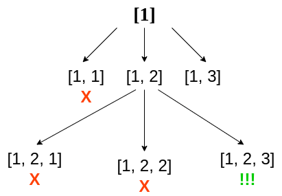

# Mathematics

1. 최대공약수(GCD/HCF): Euclidean & Modulo
2. 최소공배수(LCM): 최대공약수 재활용하기
3. 순열(Permutation): Backtracking, `𝗇P𝗇`, `𝗇P𝗋`
4. 조합(Combination)
5. 멱집합(Power Set)

<br />

## 1. 최대공약수(GCD/HCF): Euclidean & Modulo

### 1-1. Brute Force

가장 단순한 방법으로, 최대공약수가 나올 수 있는 범위 내에서 반복문을 돌며 두 수가 동시에 나누어지는 가장 큰 값을 찾아 반환합니다.

```typescript
function gcd(a: number, b: number): number {
    if (a === 0) return b
    if (b === 0) return a
    if (a === b) return a

    const smaller = a > b ? b : a
    
    for (let i = smaller; i >= 1; i -= 1) {
        if (a % i === 0 && b % i === 00) return i
    }
}
```

<br />

### 1-2. Euclidean

최대공약수를 구하는 효율적인 방법으로 유명한 [유클리드 알고리즘(Euclidean Algorithm)](https://en.wikipedia.org/wiki/Euclidean_algorithm)은 다음의 수학적 사실에 기반해서 최대공약수를 찾습니다: _큰 수에서 작은 수를 빼도, 최대공약수는 바뀌지 않는다_

<br />

예를 들어 유클리드에 따르면, 다음과 같이 큰 수에서 작은 수를 빼도 두 수의 최대공약수는 같게 됩니다.

`120`과 `50`의 최대공약수는 `10`

`70`과 `50`의 최대공약수는 `10`

`20`과 `50`의 최대공약수는 `10`

`20`과 `30`의 최대공약수는 `10`

`20`과 `10`의 최대공약수는 `10`

`10`과 `10`의 최대공약수는 `10`

<br />

따라서 두 수 `a`, `b`의 최대공약수를 구하려면, 유클리드 알고리즘을 사용하여 다음과 같이 사고할 수 있겠죠. 반복횟수는 정해져있지 않지만 Exit 조건이 명확하므로 Recursion을 사용할 수 있습니다.

- 큰 수에서 작은 수 빼기를 반복한다
- 더 이상 뺄 수 없게 되면 Exit (한 수가 `0`이 되면)
- 두 수가 같아지면 Exit
- 남아있는 수가 최대공약수이다

```typescript
function gcd(a: number, b: number): number {
    if (a === 0) return b
    if (b === 0) return a
    if (a === b) return a
    return a > b ? gcd(a - b, b) : gcd(a, b - a)
}
```

<br />

### 1-3. Euclidean & Modulo

최고의 방법은 유클리드 알고리즘에서 [Modulo(나머지 연산)](https://ko.wikipedia.org/wiki/%EB%82%98%EB%A8%B8%EC%A7%80)을 사용하는 것입니다. 뺄 수 있을 때까지 반복해서 빼는 작업을 Modulo로 대체해서 반복 횟수를 줄일 수 있기 때문입니다. [Euclidean algorithms (Basic and Extended) | GeeksForGeeks](https://www.geeksforgeeks.org/euclidean-algorithms-basic-and-extended/) 문서를 참고했습니다.

```typescript
function gcd(a: number, b: number): number {
    if (b === 0) return a
    return gcd(b, a % b)
}
```

위와 같이 리팩토링하고, `gcd(17, 5)`롤 호출하면 호출 스택에는 다음 순서대로 호출이 쌓이고, 가장 마지막에 반환되는 `1`을 얻게됩니다.

```typescript
gcd(17, 5)
gcd(5, 2)
gcd(2, 1)
gcd(1, 0) // 1
```

<br />

#### 시간복잡도

최악의 경우 시간복잡도는 `O(log(max(a,b)))`입니다. 나머지 연산을 역으로 생각해보면 최악의 경우 호출 스택은 이렇게 될건데, `a`, `b` 값을 추적해보면 [피보나치 수열](https://en.wikipedia.org/wiki/Fibonacci_number)이 되는 것을 확인할 수 있습니다. 그렇다면, 최악의 경우, `max(a, b)` 값이 증가할 수록 피보나치 수열에 따라 더 많은 단계를 건너뛸 수 있으니 호출 스택에 쌓이게 될 함수들이 증가하는 속도는 `max(a, b)`의 속도에 반비례하게 됩니다.

```typescript
...
gcd(13, 8)
gcd(8, 5)
gcd(5, 3)
gcd(3, 2)
gcd(2, 1)
gcd(1, 0)
```

> The time complexity for the above algorithm is O(log(max(a,b))) the derivation for this is obtained from the analysis of the worst-case scenario. What we do is we ask what are the 2 least numbers that take 1 step, those would be (1,1). If we want to increase the number of steps to 2 while keeping the numbers as low as possible as we can take the numbers to be (1,2). Similarly, for 3 steps, the numbers would be (2,3), 4 would be (3,5), 5 would be (5,8). So we can notice a pattern here, for the nth step the numbers would be (fib(n),fib(n+1)).  So the worst-case time complexity would be O(n) where a>= fib(n) and b>= fib(n+1).
> Now Fibonacci series is an exponentially growing series where the ratio of nth/(n-1)th term approaches (sqrt(5)-1)/2 which is also called the golden ratio. So we can see that the time complexity of the algorithm increases linearly as the terms grow exponentially hence the time complexity would be log(max(a,b)). - [Program to find GCD or HCF of two numbers | GeeksForGeeks](https://www.geeksforgeeks.org/c-program-find-gcd-hcf-two-numbers/)

<br />

### 1-4. 여러 수의 최대공약수

여러 수의 최대공약수는 두 수씩 묶어 최대공약수를 구한 후 치환하는 식으로 구할 수 있습니다. 만약 3 개의 수 `a`, `b`, `c`의 최대공약수는 위에서 [Euclidean + Modulo](./#1-3-euclidean--modulo) 조합으로 만든 `gcd(a, b)` 함수를 사용하여 다음과 같이 구할 수 있습니다.

```typescript
const result = gcd(a, gcd(b, c)) 
            // = gcd(gcd(a, b), c) 
            // = gcd(gcd(a, c), b)
```

<br />

여러 수를 배열로 받는다면 다음과 같이 해볼 수 있고요,

```typescript
type GCDFunction = (a: number, b: number) => number

function findGCD(arr: number[], gcd: GCDFunction): number {
    let result: number = arr[0]

    arr.some((item, index) => {
        if (index === 0) return false
        result = gcd(item, result)
        return result === 1        
    })

    return result
}
```

<br />

[`reduce(reducer)`](https://developer.mozilla.org/en-US/docs/Web/JavaScript/Reference/Global_Objects/Array/Reduce) 메소드를 사용해서 다음과 같이 할 수도 있겠습니다.

```typescript
type GCDFunction = (a: number, b: number) => number

function findGCD(arr: number[], gcd: GCDFunction): number {
    return arr.reduce(gcd)
}
```

<br />

## 2. 최소공배수(LCM): 최대공약수 재활용하기

### 2-1. Brute Force

가장 단순한 방법으로, 두 수를 전부 [소인수 분해](https://ko.wikipedia.org/wiki/%EC%86%8C%EC%9D%B8%EC%88%98%EB%B6%84%ED%95%B4)한 후, 겹치는 소인수들만을 곱한 값이 최소공배수가 됩니다.

```typescript
function lcm(a: number, b: number): number {
    if (a === 0 || b === 0) return 0
    if (a === 1) return b
    if (b === 1) return a
    if (a === b) return a
    ...
} 
```

<br />

### 2-2. 최대공약수 재활용하기

조금 더 우아한 방법으로는 최대공약수 함수 `gcd(a, b)`를 사용하는 것입니다. 다음의 수학적 사실에 근거해서요: _두 수의 곱은 두 수의 최소공배수와 최대공약수를 곱한 것과 같다_

`a * b = lcm(a, b) * gcd(a, b)` → `lcm(a, b) = a * b / gcd(a, b)`

이제 최소공배수 함수는 아래와 같이 심플해집니다.

```typescript
function lcm(a: number, b: number): number {
    return a * b / gcd(a, b)
}
```

<br />

### 2-3. 여러 수의 최소공배수

2개 이상의 수들을 대상으로 할 때는 최대공약수와 마찬가지로, 두 수씩 묶어 최소공배수를 구한 후 치환하는 식으로 구할 수 있습니다.

```typescript
const result = lcm(a, lcm(b, c)) 
            // = lcm(lcm(a, b), c) 
            // = lcm(lcm(a, c), b)
```

<br />

따라서 대상 수들을 배열로 받는다면, 다음과 같이 `reduce(reducer)` 메소드를 사용할 수 있습니다.

```typescript
type LCMFunction = (a: number, b: number) => number

function findLCM(arr: number[], lcm: LCMFunction): number {
    return arr.reduce(lcm)
}
```

<br />

## 3. 순열(Permutation): Backtracking, `𝗇P𝗇`, `𝗇P𝗋`

### 3-1. 정의

[순열](https://ko.wikipedia.org/wiki/%EC%88%9C%EC%97%B4)은 흔히 경우의 수를 구하는 문제에서 언급되는데, 순서가 부여된 임의의 집합을 다른 순서로 뒤섞는 것을 말합니다. 예를 들어 `A`, `B`, `C` 3 개의 단어로 만들 수 있는 순열의 수(경우의 수)는 6가지입니다: `3! = 3 * 2 * 1`

6가지 순열은 다음과 같고요.

A B C

A C B

C A B

C B A

B A C

B C A

<br />
 
수학에서는 `𝗇P𝗋`로 표시하는데, `n` 개 중 `r` 개를 뽑아 순서대로 정렬할 수 있는 경우의 수, 즉 순열의 수를 의미합니다. 계산법은 `𝗇P𝗋 = n * (n - 1) * ⋯ * (n - r + 1)`로, [Factorial](https://en.wikipedia.org/wiki/Factorial)을 사용하면 `𝗇P𝗋 = n! / (n - r)!`로 대체할 수 있습니다. 위 예시의 경우 `𝟥P𝟥`으로 표시하고, 순열의 수는 `3!` 이 됩니다.

<br />

### 3-2. Backtracking

주어진 배열에 대한 순열 조합은 [Backtracking](https://www.geeksforgeeks.org/backtracking-algorithms/) 방식으로 구할 수 있습니다.

> Backtracking is an algorithmic-technique for solving problems recursively by trying to build a solution incrementally, one piece at a time, removing those solutions that fail to satisfy the constraints of the problem at any point of time... - [Backtracking Algorithms](https://www.geeksforgeeks.org/backtracking-algorithms/)

<br />

Backtracking의 핵심은 이렇습니다.

- Recursion을 통해 모든 가능한 경우를 시도한다
- Recursive 호출시마다 값을 하나씩 추가한다
- 답이 될 수 없는 조건이 발견되면 Recursion을 멈춘다

<br />

따라서 모든 가능한 순열을 찾아야하는 문제의 특성상 Backtracking이 적절한 방법일 수 있는거죠! 답이 될 수 없는 조건도 심플하고요: _중복될 수 없다_. 가령 `A`, `B`, `C` 3 개의 글자로 순열을 만들 때 `A A B`와 같이 하나의 순열을 이루는 요소끼리 중복되어서는 안되고, 순열 자체도 서로 중복이 있어서는 안되겠죠.

- 하나의 순열을 이루는 요소끼리 중복될 수 없다
- 순열끼리 중복될 수 없다

<br />

Backtracking은 다음과 같이 Recursion을 통해 확장되는 Recursion Tree로 더 잘 이해할 수 있습니다.


<br />

### 3-3. `𝗇P𝗇`

이제 진짜 구현을 해보겠습니다. Incremental Recursion을 통해 순열 배열을 하나씩 만들어보면 됩니다. 만약 `[1, 2, 3]`이라는 배열이 주어졌다면, `[1]` → `[1, 2]` → `[1, 2, 3]` 이런식으로 Recursion을 통해 값을 하나씩 추가해볼 수 있습니다. 모든 가능한 경우를 찾기 위해 각각의 Recursive 단계에서는 배열의 모든 원소를 추가하여 검사해보고요. 이 과정에서 예를 들어, `[1, 1]`이 만들어지면 "답이 될 수 없는 조건"이므로 Recursion을 멈추게 합니다.



사진출처: [How to Solve Permutations in JavaScript - Jordan Moore](https://javascript.plainenglish.io/how-to-solve-permutations-in-javascript-502cc4522482)

<br />

`𝗇P𝗇`, 주어진 배열의 모든 원소를 대상으로 하는 순열 조합을 구하는 함수는 이렇습니다.

```typescript
function permute<T>(arr: T[]): T[][] {
    const ps: T[][] = [] // permutations

    function backtrack(arr: T[], p: T[]) {
        if (p.length === arr.length) {
            ps.push([...p]) // 복사
            return
        }

        arr.forEach(item => {
            if (!p.includes(item)) {
                p.push(item) // item을 고정시키고
                backtrack(arr, p) // 모든 가능한 순열을 시도해보자 (Backtrack)
                p.pop() // 그 다음 item에 대해 Backtrack 하기위해 Backtrack이 끝난 item은 뺀다 
            }
        })
    }

    backtrack(arr, [])
    return ps
}
```

<br />

### 3-4. `𝗇P𝗋`

`𝗇P𝗋`, 주어진 배열에서 `r`개의 원소를 대상으로 순열 조합을 구하는 것도 비슷합니다. `n`개에서 `r`개로, Backtrack의 Exit 조건만 바뀝니다.

```typescript
function permuteR<T>(arr: T[], r: number): T[][] {
    const ps: T[][] = [] // permutations

    function backtrack(arr: T[], p: T[]) {
        if (p.length === r) {
            ps.push([...p]) // 복사
            return
        }

        arr.forEach(item => {
            if (!p.includes(item)) {
                p.push(item) // item을 고정시키고
                backtrack(arr, p) // 모든 가능한 순열을 시도해보자 (Backtrack)
                p.pop() // 그 다음 item에 대해 Backtrack 하기위해 Backtrack이 끝난 item은 뺀다 
            }
        })
    }

    backtrack(arr, [])
    return ps
}
```

<br />

---

### References

- [Program to find GCD or HCF of two numbers | GeeksForGeeks](https://www.geeksforgeeks.org/c-program-find-gcd-hcf-two-numbers/)
- [GCD of more than two (or array) numbers | GeeksForGeeks](https://www.geeksforgeeks.org/gcd-two-array-numbers/)
- [Program to find LCM of two numbers | GeeksForGeeks](https://www.geeksforgeeks.org/program-to-find-lcm-of-two-numbers/?ref=lbp)
- [Write a program to print all permutations of a given string | GeeksForGeeks](https://www.geeksforgeeks.org/write-a-c-program-to-print-all-permutations-of-a-given-string/)
- [How to Solve Permutations in JavaScript - Jordan Moore](https://javascript.plainenglish.io/how-to-solve-permutations-in-javascript-502cc4522482)